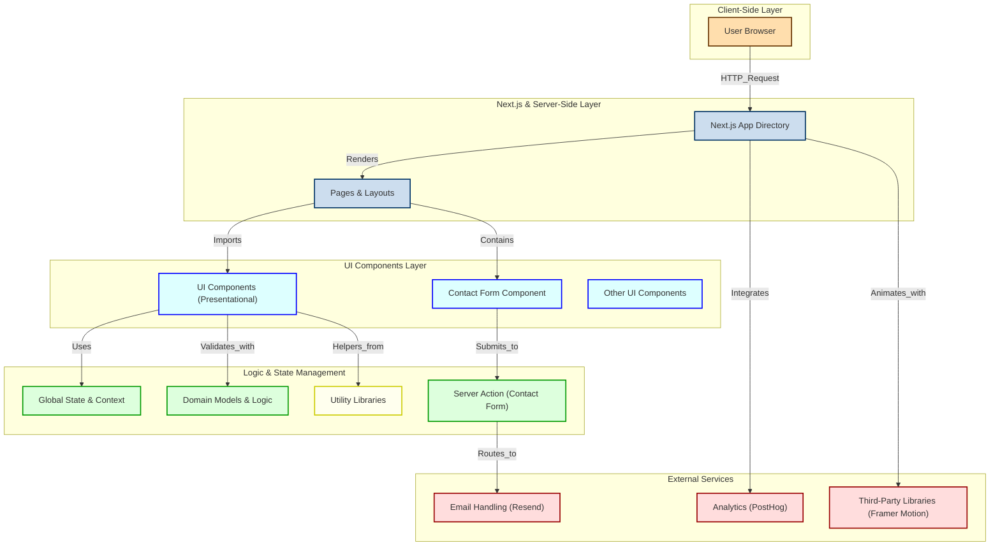

# Eduardo Couto's Portfolio

Welcome to my portfolio repository! This project showcases my skills, projects, and experiences as a software developer. Built with [Next.js](https://nextjs.org/), this portfolio highlights my journey and the work I am passionate about.

## Getting Started

First, run the development server:

```bash
pnpm dev

Open http://localhost:3000 with your browser to see the result.

You can start editing the page by modifying src/app/page.tsx. The page auto-updates as you edit the file.
```

## Technical Documentation

This section provides an overview of the technical aspects of the project.



### Frameworks and Libraries

- **Next.js 14**: This project is built using Next.js 14 with the App Directory structure. Next.js is a React framework that enables server-side rendering and generating static websites for React-based web applications.
- **React**: A JavaScript library for building user interfaces, particularly single-page applications where data changes over time.
- **Framer Motion**: Used for animations within the portfolio. It provides a simple yet powerful way to create animations and gestures for React elements.
- **Resend**: Utilized for handling email functionalities within the project.

### Project Structure

The project follows a modular architecture with the following main directories:

- **/src**: Contains the source code for the application.
  - **/app**: Includes the main application files such as layout and main page components.
  - **/components**: Houses all the React components used throughout the application.
  - **/context**: Contains context providers for managing global state.
  - **/domain**: Defines domain-specific logic and data structures.
  - **/lib**: Includes utility functions, hooks, and other libraries.
  - **/actions**: Contains server actions such as form submissions.
- **/public**: Holds static assets like images and the resume PDF.

### Key Features

- **Dynamic Content Rendering**: The portfolio dynamically renders content from various React components to provide a seamless and interactive user experience.
- **Responsive Design**: Ensures the portfolio is accessible and visually appealing on different devices and screen sizes.
- **Animations**: Utilizes Framer Motion for smooth and engaging animations throughout the site.
- **Email Handling**: Implements Resend for managing email communications through contact forms.

## About Me

After graduating with a degree in **Informatics Engineering**, I pursued my passion for software development. I have extensive experience in **full-stack development** through various roles and projects. My favorite part of programming is the problem-solving aspect. I love the feeling of finally figuring out a solution to a complex problem.

My core stack includes **Java, React, Angular, Quarkus, and Node.js**. I am also proficient in **AWS, Terraform, and Kubernetes**. I am always looking to learn new technologies and continuously improve my skills. I am currently open to **collaboration and new projects** in the field of software development.

## Contact

Feel free to reach out to me for collaboration or inquiries:

- Email: [contacts@eduardocouto.dev](mailto:contacts@eduardocouto.dev)
- Or use the form on the [Contact](#contact) section of this portfolio.
